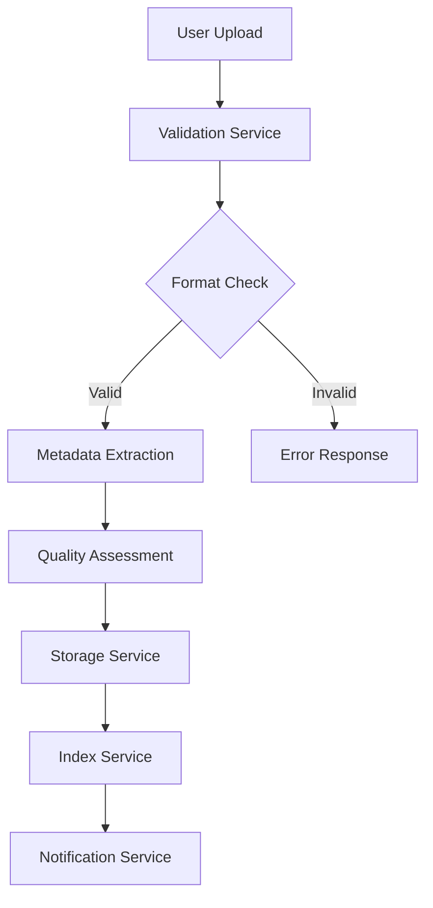
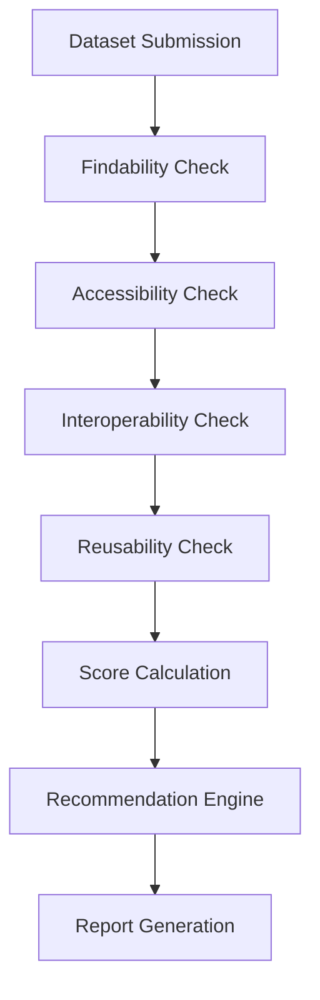

# FAIRDataHub - System Architecture

## 🏗️ System Overview

FAIRDataHub is a comprehensive research data management platform designed to help institutions implement FAIR data principles at scale. The platform provides a unified interface for data ingestion, metadata management, quality assessment, and controlled sharing.

## 🎯 Core Components

### 1. Data Ingestion Layer
- **Multi-format Support**: CSV, JSON, XML, HDF5, NetCDF, FITS
- **Batch Processing**: Large dataset upload with progress tracking
- **Validation Pipeline**: Automated data quality checks
- **Metadata Extraction**: Automatic schema detection and metadata generation

### 2. Metadata Management System
- **Schema Registry**: Support for multiple metadata standards (Dublin Core, DataCite, Schema.org)
- **Vocabulary Management**: Controlled vocabularies and ontology integration
- **Provenance Tracking**: Complete data lineage documentation
- **Version Control**: Git-like versioning for datasets and metadata

### 3. FAIR Assessment Engine
- **Automated Scoring**: Real-time FAIR compliance assessment
- **Recommendation System**: Actionable suggestions for improvement
- **Quality Metrics**: Data quality indicators and visualization
- **Compliance Reports**: Detailed reports for stakeholders

### 4. Access Control & Sharing
- **Role-based Permissions**: Granular access control system
- **Data Access Committee (DAC)**: Workflow for controlled access requests
- **API Gateway**: RESTful and GraphQL APIs for programmatic access
- **Federated Search**: Cross-institutional data discovery

## 🏛️ Technical Architecture

### Frontend Layer
```
┌─────────────────────────────────────┐
│           Web Interface             │
│  React + TypeScript + Material-UI  │
├─────────────────────────────────────┤
│        Mobile Application           │
│      React Native + Expo           │
└─────────────────────────────────────┘
```

### API Layer
```
┌─────────────────────────────────────┐
│          API Gateway                │
│       Kong + OAuth 2.0             │
├─────────────────────────────────────┤
│      Microservices Architecture     │
│   Node.js + Express + TypeScript    │
│                                     │
│  ┌─────────┐ ┌─────────┐ ┌────────┐ │
│  │ Data    │ │Metadata │ │ FAIR   │ │
│  │Service  │ │Service  │ │Service │ │
│  └─────────┘ └─────────┘ └────────┘ │
│                                     │
│  ┌─────────┐ ┌─────────┐ ┌────────┐ │
│  │ User    │ │ Search  │ │Workflow│ │
│  │Service  │ │Service  │ │Service │ │
│  └─────────┘ └─────────┘ └────────┘ │
└─────────────────────────────────────┘
```

### Data Layer
```
┌─────────────────────────────────────┐
│         Message Queue               │
│      Redis + Bull Queue             │
├─────────────────────────────────────┤
│        Primary Database             │
│      PostgreSQL + TimescaleDB       │
├─────────────────────────────────────┤
│        Document Database            │
│         MongoDB Atlas               │
├─────────────────────────────────────┤
│         Search Engine               │
│       Elasticsearch + Kibana        │
├─────────────────────────────────────┤
│         Object Storage              │
│      MinIO / AWS S3 Compatible      │
└─────────────────────────────────────┘
```

## 🔄 Data Flow Architecture

### 1. Data Ingestion Flow


### 2. FAIR Assessment Flow


## 🐳 Deployment Architecture

### Container Orchestration
- **Container Runtime**: Docker + Docker Compose (dev) / Kubernetes (prod)
- **Service Mesh**: Istio for microservices communication
- **Load Balancer**: NGINX Ingress Controller
- **Auto-scaling**: Horizontal Pod Autoscaler (HPA)

### Infrastructure Components
```yaml
# Kubernetes Deployment Structure
apiVersion: v1
kind: Namespace
metadata:
  name: fairdatahub

---
# Frontend Deployment
apiVersion: apps/v1
kind: Deployment
metadata:
  name: frontend
  namespace: fairdatahub
spec:
  replicas: 3
  selector:
    matchLabels:
      app: frontend
  template:
    metadata:
      labels:
        app: frontend
    spec:
      containers:
      - name: frontend
        image: fairdatahub/frontend:v1.0.0
        ports:
        - containerPort: 3000
        env:
        - name: API_BASE_URL
          value: "https://api.fairdatahub.org"

---
# API Gateway Deployment
apiVersion: apps/v1
kind: Deployment
metadata:
  name: api-gateway
  namespace: fairdatahub
spec:
  replicas: 2
  selector:
    matchLabels:
      app: api-gateway
  template:
    metadata:
      labels:
        app: api-gateway
    spec:
      containers:
      - name: api-gateway
        image: fairdatahub/api-gateway:v1.0.0
        ports:
        - containerPort: 8080
```

## 🔐 Security Architecture

### Authentication & Authorization
- **Identity Provider**: Keycloak with LDAP/SAML integration
- **API Security**: JWT tokens with refresh mechanism
- **Multi-factor Authentication**: TOTP and SMS support
- **Single Sign-On**: SAML 2.0 and OpenID Connect

### Data Security
- **Encryption at Rest**: AES-256 encryption for stored data
- **Encryption in Transit**: TLS 1.3 for all communications
- **Key Management**: HashiCorp Vault for secrets management
- **Audit Logging**: Comprehensive audit trail for all operations

### Network Security
```
┌─────────────────────────────────────┐
│              WAF                    │
│         Cloudflare                  │
├─────────────────────────────────────┤
│          Load Balancer              │
│            NGINX                    │
├─────────────────────────────────────┤
│         DMZ Network                 │
│      Public Services                │
├─────────────────────────────────────┤
│       Internal Network              │
│     Private Services                │
├─────────────────────────────────────┤
│         Database Network            │
│        Isolated Subnet              │
└─────────────────────────────────────┘
```

## 📊 Monitoring & Observability

### Application Monitoring
- **Metrics Collection**: Prometheus + Grafana
- **Distributed Tracing**: Jaeger for request tracing
- **Log Aggregation**: ELK Stack (Elasticsearch, Logstash, Kibana)
- **Health Checks**: Kubernetes liveness and readiness probes

### Business Intelligence
- **Usage Analytics**: Custom dashboards for platform usage
- **FAIR Metrics**: Institutional FAIR compliance tracking
- **Performance Metrics**: Dataset access patterns and optimization
- **User Behavior**: Anonymized user interaction analysis

## 🔧 Development Workflow

### CI/CD Pipeline
```yaml
# GitHub Actions Workflow
name: Deploy to Production
on:
  push:
    branches: [main]

jobs:
  test:
    runs-on: ubuntu-latest
    steps:
      - uses: actions/checkout@v3
      - name: Run Tests
        run: |
          npm test
          npm run e2e
          
  build:
    needs: test
    runs-on: ubuntu-latest
    steps:
      - name: Build Docker Images
        run: |
          docker build -t fairdatahub/frontend:${{ github.sha }} .
          docker push fairdatahub/frontend:${{ github.sha }}
          
  deploy:
    needs: build
    runs-on: ubuntu-latest
    steps:
      - name: Deploy to Kubernetes
        run: |
          kubectl set image deployment/frontend frontend=fairdatahub/frontend:${{ github.sha }}
          kubectl rollout status deployment/frontend
```

## 🎯 Performance Considerations

### Scalability Patterns
- **Horizontal Scaling**: Stateless microservices design
- **Database Sharding**: Partition large datasets across multiple databases
- **Caching Strategy**: Multi-layer caching (Redis, CDN, Application)
- **Background Processing**: Async job processing with queue management

### Optimization Strategies
- **CDN Integration**: Global content delivery for static assets
- **Database Optimization**: Query optimization and indexing strategies
- **Resource Management**: CPU and memory limits for containers
- **Network Optimization**: Compression and protocol optimization

## 🔄 Backup & Disaster Recovery

### Backup Strategy
- **Database Backups**: Daily full backups with point-in-time recovery
- **File Storage Backups**: Incremental backups with versioning
- **Configuration Backups**: Infrastructure as Code (IaC) with Terraform
- **Cross-region Replication**: Geographic redundancy for critical data

### Disaster Recovery Plan
- **RTO (Recovery Time Objective)**: 4 hours for critical services
- **RPO (Recovery Point Objective)**: 1 hour maximum data loss
- **Failover Procedures**: Automated failover with health checks
- **Testing Schedule**: Monthly disaster recovery drills

---

This architecture ensures FAIRDataHub can scale to support large research institutions while maintaining high availability, security, and FAIR compliance standards.